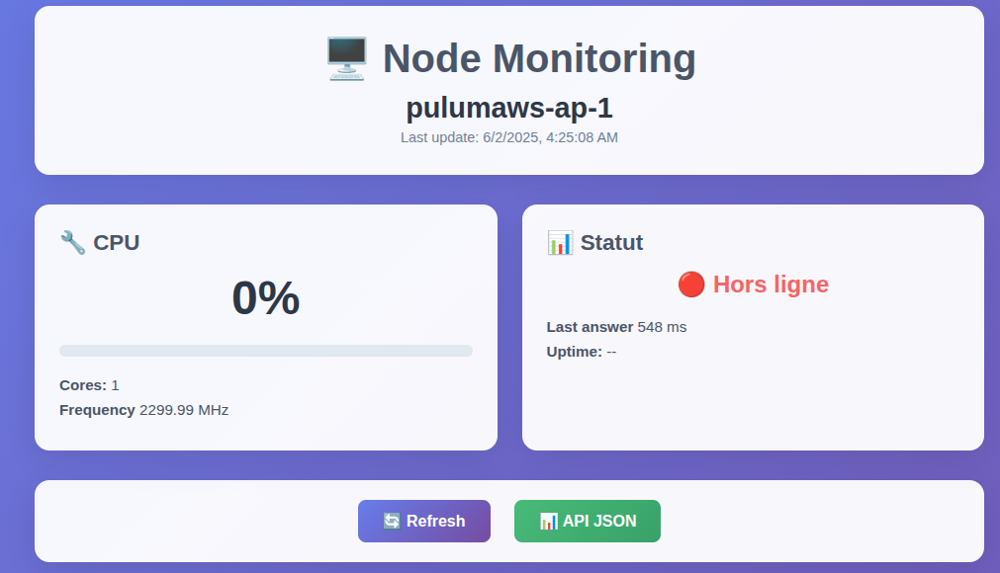

<div align="center">

[](https://skillicons.dev)

</div>


# Pulumaws

- [Pulumaws](#pulumaws)
  - [Usage](#usage)
    - [Full usage](#full-usage)
    - [logs](#logs)
  - [Installation](#installation)
    - [Requirements](#requirements)
    - [Install](#install)
  - [Configuration](#configuration)
  - [Troubleshooting](#troubleshooting)


This project is a **Linux** tool to deploy a Docker Swarm into Amazon Web Services EC2 instances.  

> I wrote this tool to understand how to work with tools like AWS, Pulumi, Docker and Tailscale. This tool does not have a usefull utility as it, but feel free to use it as a canva and/or modify it.

**Pulumaws** deploys an arbitrary amount of EC2 instances in any AWS region. Every instance will be connected together through a Tailscale VPN mesh network. This helps with connection and makes the system more secure, consistent with the [Zero Trust Architecture](https://tailscale.com/kb/1123/zero-trust). Then, a Docker Swarm can be deployed to monitor each instance. 

## Usage

First, configure your network (see [configuration](#configuration)).

Then, use the `deploy_ec2.sh` script to deploy, or destroy your Swarm. 

To deploy with the Swarm : 

	./deploy_ec2.sh deploy --swarm

When everything is online, you can connect to the monitoring dashboard of each instance : 

	http://{NAME}:8080/

where {NAME} is the hostname of your node in Tailscale (see [troubleshooting 2](#troubleshooting)).



> You can see the Hostname with the command `tailscale status`

### Full usage

	Usage : pulumaws.sh [help|<action>] [flags]
		help : Show this help message
		<action> : deploy | destroy | preview
			deploy : Deploy the stack
           	destroy : Destroy the stack
          	preview : Preview the stack changes
 			
			--swarm : Optional flag to deploy swarm

### logs

When instances are created, some information is printed to `/logs/instances.json`

Example : 

```json
[
    {
        "name": "pulumaws-ap-1",
        "instance_id": "i-0c0791e44475e546b",
        "public_ip": "13.236.153.81",
        "instance_type": "t2.micro",
        "region": "ap-southeast-2a"
    },
    {
        "name": "pulumaws-ap-2",
        "instance_id": "i-0a9e03749526cbba3",
        "public_ip": "3.106.226.30",
        "instance_type": "t2.micro",
        "region": "ap-southeast-2a"
    },
    {
        "name": "pulumaws-ap-3",
        "instance_id": "i-028c2936551eb3bcc",
        "public_ip": "3.106.214.6",
        "instance_type": "t2.micro",
        "region": "ap-southeast-2a"
    },
    {
        "name": "pulumaws-ap-4",
        "instance_id": "i-0656aa4e53da3c2e2",
        "public_ip": "54.252.160.175",
        "instance_type": "t2.micro",
        "region": "ap-southeast-2a"
    }
]

```


## Installation

### Requirements

You first need to have Pulumi installed on your machine, and ready to start for AWS : see [Pulumi getting started for AWS](https://www.pulumi.com/docs/iac/get-started/aws/). Make sure you can access to your AWS account with Pulumi.

You need to have also *Tailscale* , *Docker* and *pip*.

> This tool has been developped and tested only in Ubuntu 24.04

### Install

Then you can follow the next steps :

1. Clone the project or download the ZIP file
2. Set up your keys in `/lib/keys` : Tailscale key, AWS key (optional)
3. Grant executions rights to `install.sh`
4. Run it 
5. Configure your `.env` file (see [configuration](#configuration))


## Configuration

To configure, you should only interact with the `.env` file and with the `regions.yaml`. 

Here is an example of a configuration file with full descriptions : 

```.env

# configuration file

# === instances options ===

INSTANCE_TYPE = t2.micro
# instance type of the AWS EC2 to be created

INSTANCE_BASE_NAME = pulumaws
# base name : instances will be named for example pulumaws-1, pulumaws-2 etc

INSTANCE_OS = ubuntu 
# supported OS : ubuntu or amazon-linux-2
# WARNING : only ubuntu supports Swarm for now

REGIONS_PATH = regions.yaml
# path to the file with the repartition of instances


# === network options ===
# DEPRECIATED : those options will allow an IP to connect directly to the instances. It is not recommanded to 
# use this option because of difficulties to define the owner IP. Instead, use Tailscale 

PUB_KEY_PATH = lib/keys/key-hello-aws.pub
PUB_KEY_NAME = key-hello-aws.pub
SSH_IP_TO_ALLOW = None
# if 0.0.0.0/0 is entered, the IP of the user will be choosen 
# if None is entered, no IP will be allowed

# === Tailscale options ===
TAILSCALE_AUTH_KEY_PATH = lib/keys/tailscale-key
# your Tailscale auth key path to connect the instances to your VPN

# === Swarm options ===
SWARM_MANAGER_IP=100.124.165.62
# This IP should match the IP of your main manager (use the Tailscale IP)

SWARM_JOIN_TOKEN=
# DO NOT TOUCH : this field will be auto completed and cleaned

SWARM_STACK_NAME=monitoring
```

For the location of the machines, write it into the `regions.yaml`. The only regions written by default are the one included in the Free Tier, change them only if you want to pay. If not, change only the amount in each location. 

## Troubleshooting

1. Make sure your virtual environment is named as in `Pulumi.yaml` in the `runtime/options/virtualenv` parameter.
2. Make sure your Tailscale DNS is enabled. For the Hostame, refer only to the Tailscale name and not the Docker node hostname.
